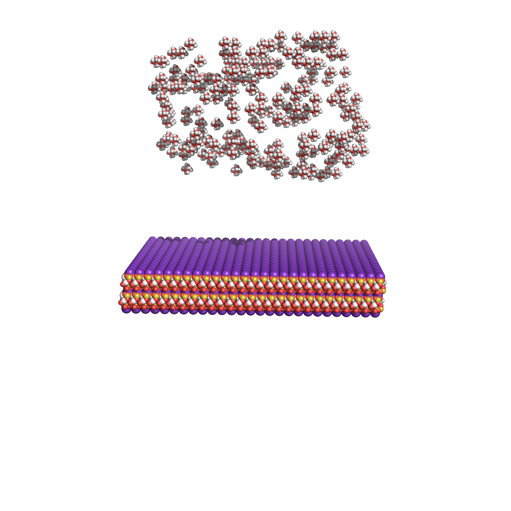
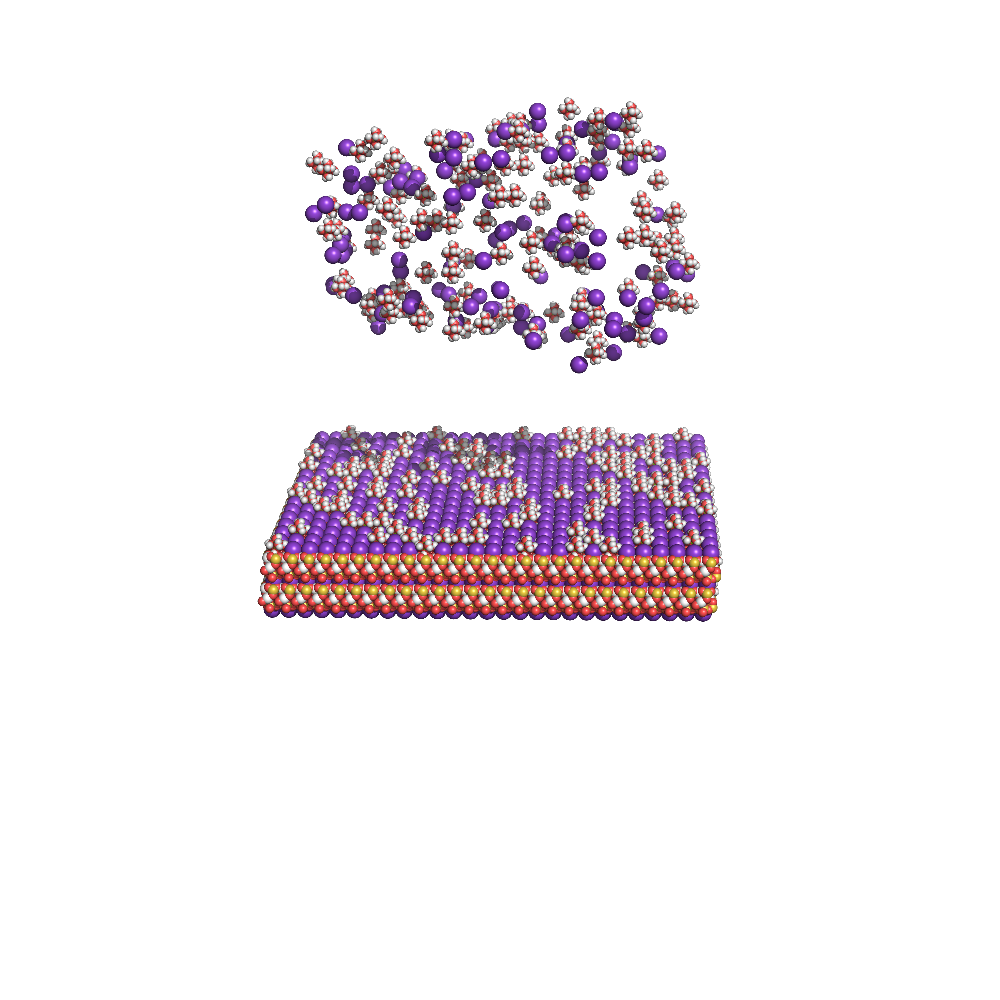

#
Introduction: This Python script is designed to simulate the replacement of potassium (K+) ions on the surface of Mica with hexahydrated magnesium (Mg2+)6(H2O) ions. The aim is to mimic experimental conditions for conducting adsorption studies of Nucleosomes using molecular dynamics simulations. In experimental setups, Mica is typically pre-equilibrated with a buffer containing magnesium. This script facilitates structural modifications to approximate such experimental conditions for MD simulations.

Disclaimer:

This script does not adhere to PEP8 guidelines. Below are structural snapshots for comparing the original model with the modified models.




After using the python program



```python

```


```python

```
